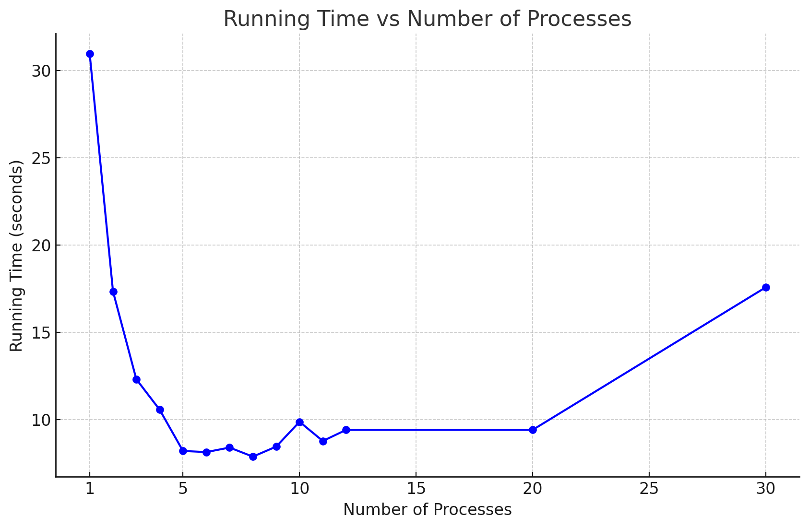

# CourseProject_Similarity
**load_and_save.py** 

 

This Python script is designed to load image batches from the CIFAR-10 dataset, a widely used dataset for machine learning and computer vision research. It extracts the images and their corresponding labels from the dataset's binary batch files and saves them as individual image files in a specified directory. 

 

**Features** 

- Load CIFAR-10 Batches: Reads the CIFAR-10 binary batch files to extract image data and labels. 
- Image Reshaping and Conversion: Transforms image data to a human-readable format (RGB channels, height, width). 
- Save Images: Saves each image from the dataset as a separate PNG file, labeled with its index and class label. 

 

**Requirements** 

- Python 3 
- NumPy 
- Matplotlib 
- scikit-image (skimage) 

 

**Usage** 

- Prepare CIFAR-10 Dataset: Download the CIFAR-10 dataset in binary format and place it in a directory named cifar-10-batches-py within your working directory. 
- Run the script: Execute the script using Python. It will read each batch file, extract images and labels, and save them in a directory. 
- Output: The images will be saved in a directory structure cifar_images/cifar-10-batches-py/... Each image will be named in the format image_{index}_label_{label}.png.

**The output of MPI running**
<figure>
  
  </figure>
